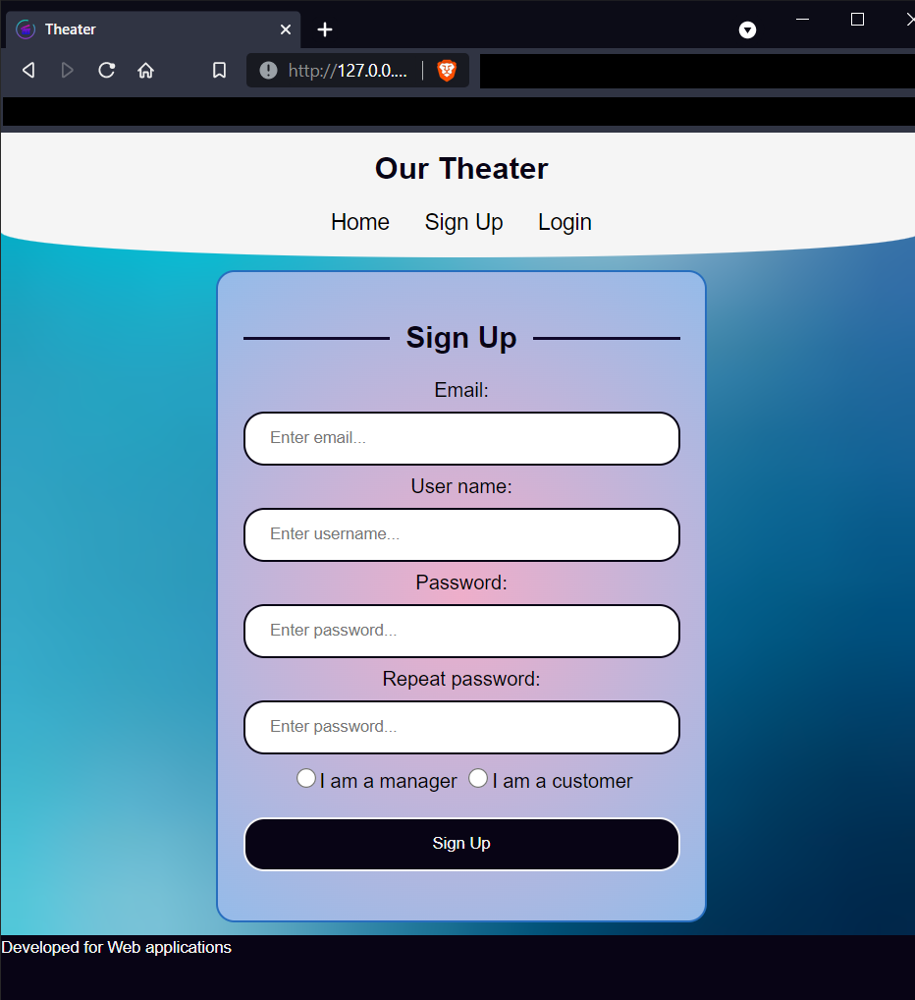
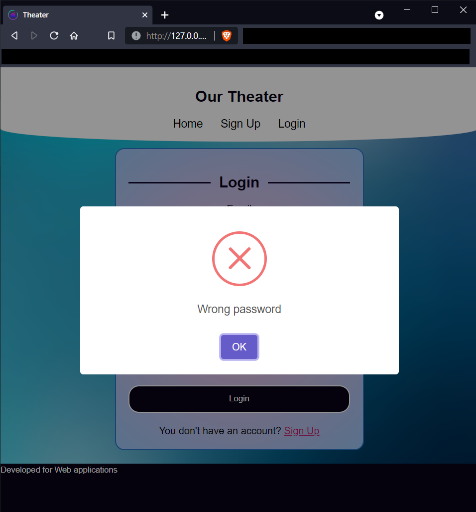
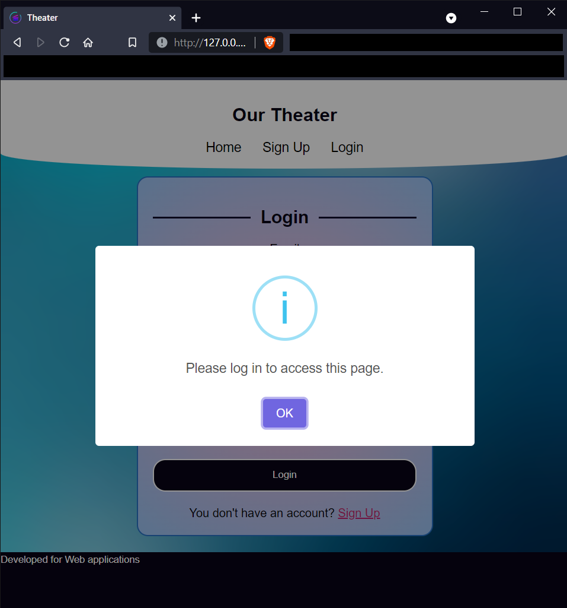
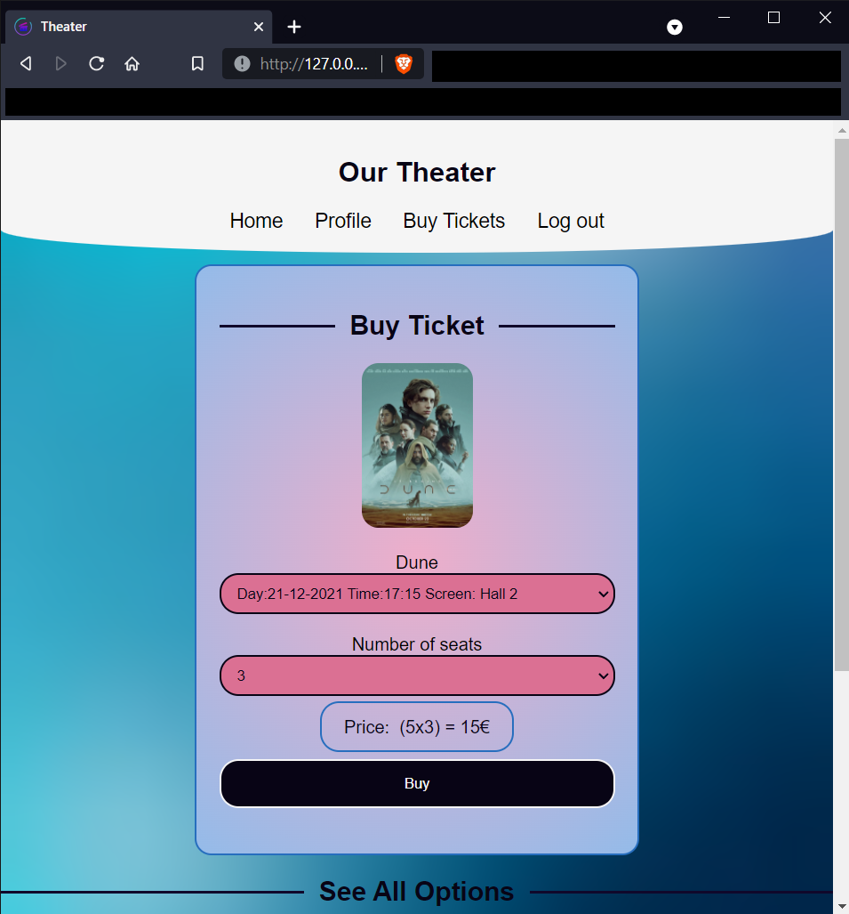
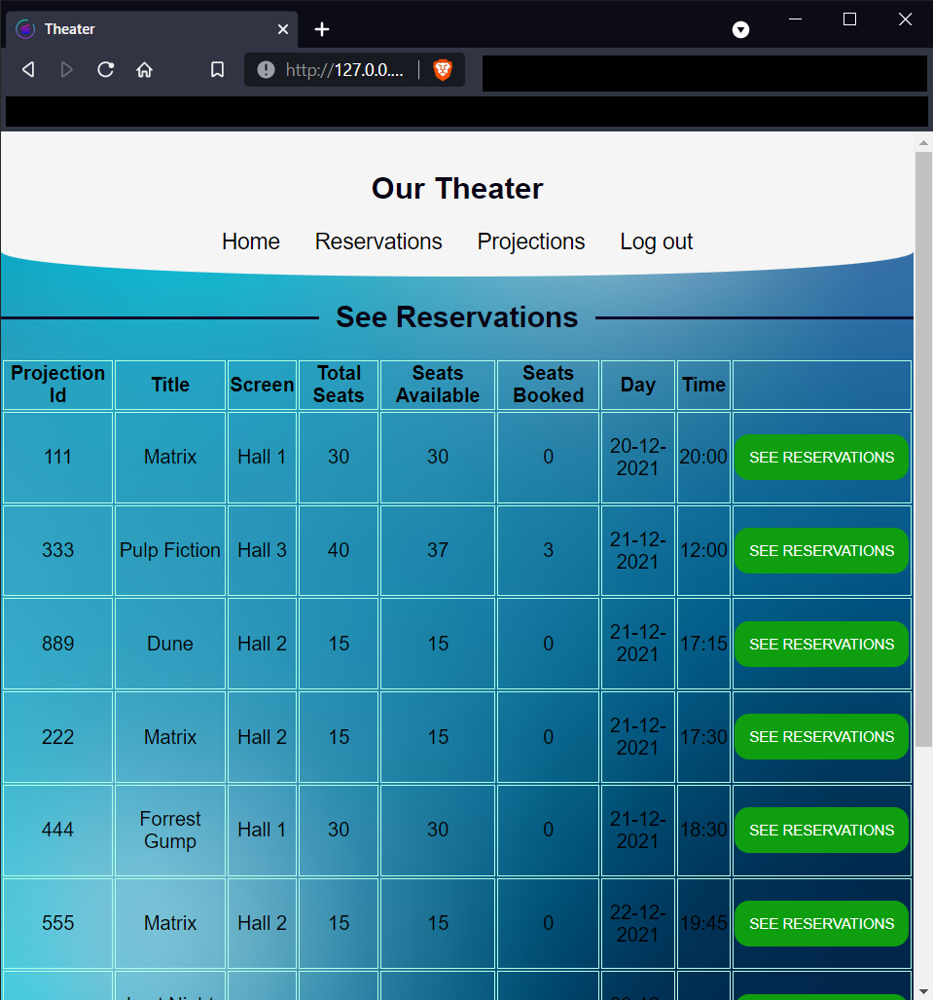

<h1 align="center">
   
  Theater Web App with Flask
</h1>
<h4 align="center">A theater management and ticket booking system</h5>


<br>
<details open="open">
  <summary>Table of Contents</summary>
  <ul>
    <li><a href="#project-description">Project Description</a></li>
    <li><a href="#theater-app-screenshots">Theater App Screenshots</a></li>
    <li><a href="#technology">Technology</a></li>
  </ul>
</details>


## Project Description
This project is developed as part of the Evaluation of the Web Applications Course at PLP. 


## Theater App Screenshots

<table>
  <tr>
    <th>Sign Up</th>
    <th>Login</th>
  </tr>
  <tr>
    <td></td>
    <td></td>
  </tr>
 </table>

<table>
  <tr>
    <th>Success</th>
    <th>Error</th>
    <th>Info</th>
  </tr>
  <tr>
    <td></td>
    <td></td>
    <td></td>
  </tr>
 </table>

<table>
  <tr>
    <th>Home</th>
  </tr>
  <tr>
    <td></td>
  </tr>
 </table>


<table>
  <tr>
    <th>Movie View</th>
    <th>Buy Ticket</th>
  </tr>
  <tr>
    <td></td>
    <td></td>
  </tr>
 </table>

<table>
  <tr>
    <th>Manager Reservations View</th>
    <th>Manager Edit View</th>
  </tr>
  <tr>
    <td></td>
    <td></td>
  </tr>
</table>


<table>
  <tr>
    <th>Add Projection</th>
    <th>Edit Projection</th>
  </tr>
  <tr>
    <td></td>
    <td></td>
  </tr>
</table>

## Technology
- Backend:
  * Python
  * Flask Framework
  * SQLAlchemy
- Fronted:
  * HTML
  * CSS
  * JavaScipt + JQuery + AJAX

## Running the Application

### Setup Virtual Environment and Install Dependencies

For Windows:

```bash
py -3 -m venv virtual
virtual\Scripts\activate
pip install -U pip
pip install Flask python-dateutil
pip install flask-sqlalchemy mysqlclient
pip install flask-bcrypt
pip install flask-login
```

For Linux:

```bash
python3 -m venv virtual
. virtual/bin/activate
pip install -U pip
pip install Flask python-dateutil
pip install flask-sqlalchemy mysqlclient
pip install flask-bcrypt
pip install flask-login
```

### Running the Flask App

For Windows:

```bash
virtual\Scripts\activate
pip install Flask python-dateutil flask-sqlalchemy mysqlclient flask-bcrypt flask-login
$env:FLASK_APP="theater"
$env:FLASK_ENV="development"
python -m flask run
```

### Stopping the Flask App

To stop the Flask app running on port 5000:

```bash
netstat -ano | findstr :5000
taskkill /PID <pid> /F
```

Replace `<pid>` with the process ID found from the netstat command.

